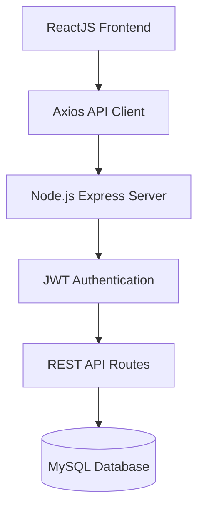
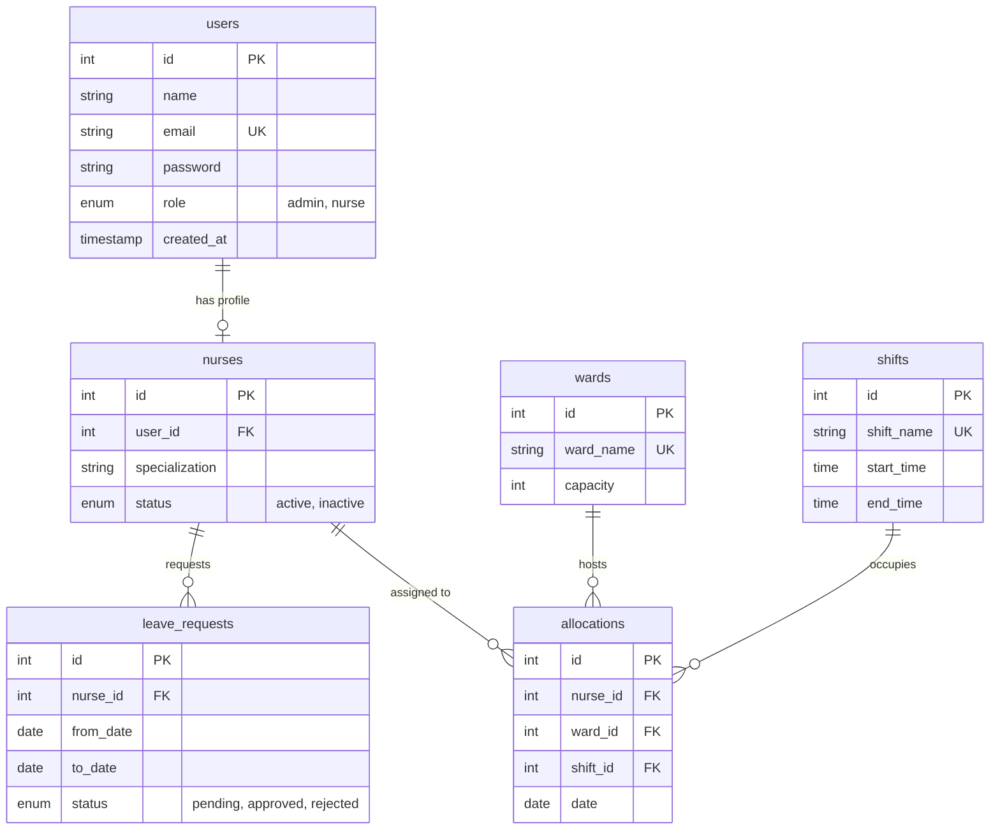

# 🏥 NurseAssign Pro — Nursing Allocation Management System

[](https://nodejs.org/)
[](https://www.mysql.com/)
[](https://react.dev/)
[](#-tech-stack)

NurseAssign Pro is a clean, modern, enterprise-grade hospital workforce management SaaS application designed for clinical administrators and nursing staff. The platform streamlines scheduling by auto-allocating active nurses to shifts and wards while actively resolving scheduling conflicts, capacity limits, and leave request overlaps.

This application is built as a highly scalable, backend-driven platform using industry-standard design patterns, suitable for recruitment evaluation at **AffordMed**.

---

## 📌 Table of Contents
1. [Core Features](#-core-features)
2. [Tech Stack](#-tech-stack)
3. [System Architecture](#-system-architecture)
4. [Database Design & Schema](#-database-design--schema)
5. [API Endpoint Reference](#-api-endpoint-reference)
6. [Getting Started & Local Setup](#-getting-started--local-setup)
7. [Windows / PowerShell Troubleshooting](#-windows--powershell-troubleshooting)
8. [Default Credentials](#-default-credentials)
9. [Automated Verification Suite](#-automated-verification-suite)

---

## 🧠 Core Features

### 1. Workload-Balanced Auto-Allocation
- **Vacant Slots Matching**: Automatically scans all hospital wards and duty shifts for a target date to identify unstaffed slots.
- **Fair Load Distribution**: Prioritizes eligible active nurses who have worked the **fewest shifts in the last 7 days**, reducing burnout and ensuring fair workload balancing.

### 2. Conflict Prevention Engine
- **Double-Booking Block**: Restricts assigning a nurse to multiple shifts on the same day.
- **Leave Request Guard**: Automatically prevents allocations if a nurse has an approved leave range overlapping the target date.
- **Capacity Enforcement**: Restricts adding further allocations to a ward if its configured shift capacity threshold has been reached.

### 3. Integrated Leave & Roster Lifecycle
- When an administrator **approves** a nurse's leave request, the system automatically sweeps and **deletes all pre-existing shift allocations** for that nurse during the leave dates.

### 4. Professional SaaS Dashboard
- **Admin Panel**: Displays real-time aggregated stats (Total Staff, Active Shifts, Pending Leaves) and visual data trends (availabilities ratio, daily duties count) powered by **Chart.js**.
- **Nurse Portal**: Displays personal duty calendars, upcoming locations, shift times, and an interface to apply for leaves and view history.

---

## ⚙️ Tech Stack

### Frontend
- **ReactJS**: Functional components with custom hooks.
- **Axios**: Configured client instance with request/response interceptors to attach JWT tokens and handle session expirations.
- **Chart.js**: Render data trends.
- **Lucide Icons**: SaaS dashboard icons.

### Backend
- **Node.js + Express**: Modular controller router layout, input validator middlewares, and a global error handling layout.
- **MySQL**: Relational database structure using pooled connections via `mysql2/promise`.

---

## 🏗 System Architecture


## 🗄️ Database Design & Schema

The MySQL database schema contains the following relational tables:



---

## 🔌 API Endpoint Reference

All endpoints (except login/registration) require a valid JWT token passed in the header:  
`Authorization: Bearer <TOKEN>`

| Endpoint | Method | Role | Description |
| :--- | :--- | :--- | :--- |
| **`/api/auth/register`** | `POST` | Public | Register an Admin or Nurse account |
| **`/api/auth/login`** | `POST` | Public | Authenticate credentials and retrieve a JWT token |
| **`/api/auth/profile`** | `GET` | All | Fetch active session profile details |
| **`/api/auth/profile`** | `PUT` | Nurse | Nurse updates specialization field |
| **`/api/nurses`** | `GET` | Admin | Fetch paginated list of nurses (supports `?search=`) |
| **`/api/nurses`** | `POST` | Admin | Register a new nurse user |
| **`/api/nurses/:id`** | `PUT` | Admin | Update nurse profile and account details |
| **`/api/nurses/:id`** | `DELETE`| Admin | Delete nurse account and related data cascades |
| **`/api/wards`** | `GET` | All | Get list of all hospital wards and capacities |
| **`/api/wards`** | `POST` | Admin | Create a new hospital ward |
| **`/api/shifts`** | `GET` | All | Fetch all duty shifts and timings |
| **`/api/allocations`** | `GET` | All | Fetch all allocations (supports `?date=` and pagination) |
| **`/api/allocations`** | `POST` | Admin | Manually allocate a nurse (runs conflict checks) |
| **`/api/allocations/auto`** | `POST` | Admin | Run auto-scheduling workload balancer |
| **`/api/allocations/my`** | `GET` | Nurse | Get personal roster schedule duties |
| **`/api/allocations/analytics`** | `GET` | All | Get aggregated dashboard metrics and Chart.js data |
| **`/api/leaves`** | `GET` | Admin | Get paginated leaves log list |
| **`/api/leaves/my`** | `GET` | Nurse | Fetch own leave requests history |
| **`/api/leaves`** | `POST` | Nurse | Apply for a leave interval (checks overlaps) |
| **`/api/leaves/:id`** | `PUT` | Admin | Approve or reject a leave request |

---

## 🚀 Getting Started & Local Setup

### 📋 Prerequisites
- **Node.js** (v18.0.0 or higher)
- **NPM** (v9.0.0 or higher)
- **MySQL Server** (local instance port `3306`)

---

### 📥 Step-by-Step Installation

#### 1. Setup the Database
You can automatically initialize, run, and seed the local database by running the PowerShell helper script in the project root:

```powershell
# Open terminal in root folder and execute:
powershell -ExecutionPolicy Bypass -File ./start-db.ps1
```
*Leave this terminal running. The script configures a localized database folder (`mysql-data`) and seeds it with default users, shifts, and wards.*

#### 2. Run the Express Backend
Open a second terminal window, navigate to the `backend` folder, install dependencies, and run the server:

```bash
cd backend
npm install
npm.cmd start     # Use 'npm.cmd start' if regular 'npm start' gets blocked
```
You should see:
`Express server running on port 5000`  
`MySQL Connection Pool initialized successfully.`

#### 3. Run the React Frontend
Open a third terminal window, navigate to the `frontend` folder, install dependencies, and start the Vite client:

```bash
cd frontend
npm install
npm.cmd run dev   # Use 'npm.cmd run dev' if regular 'npm' gets blocked
```
You should see:
`Local: http://localhost:3000/`

Open **[http://localhost:3000](http://localhost:3000)** in your browser.

---

## 🛠️ Windows / PowerShell Troubleshooting

On Windows systems, running raw `npm` commands inside PowerShell can trigger execution policy errors:
> *File C:\Program Files\nodejs\npm.ps1 cannot be loaded because running scripts is disabled on this system...*

### Solution 1: Use `.cmd` Extension (Simplest)
PowerShell blocks `.ps1` files but allows running binary batch commands. Append `.cmd` to your standard node commands:
- **Run Backend**: `npm.cmd start`
- **Run Frontend**: `npm.cmd run dev`

### Solution 2: Bypass Session Policy
Run this command once in your PowerShell terminal to temporarily permit script execution for your active session:
```powershell
Set-ExecutionPolicy -Scope Process -ExecutionPolicy Bypass
```

---

## 🔑 Default Credentials

The database comes pre-seeded with the following credentials:

### 1. Administrator Account
- **Email**: `admin@hospital.com`
- **Password**: `admin123`

### 2. Nurse Account (Sarah Jenkins)
- **Email**: `sarah.j@hospital.com`
- **Password**: `nurse123`

---

## 🧪 Automated Verification Suite

We have provided a verification script that validates database connection pool integrity, hashes passwords using bcrypt, generates tokens via JWT, and tests conflict validation rules:

```bash
# In the project root folder run:
node backend/tests/verify.js
```
## 🎥 Project Demo

**Demo Video:**
[https://drive.google.com/your-link](https://drive.google.com/file/d/1hmADgKor7Pdk1FbEPzVDd2twzFMzpA0w/view?usp=sharing)
